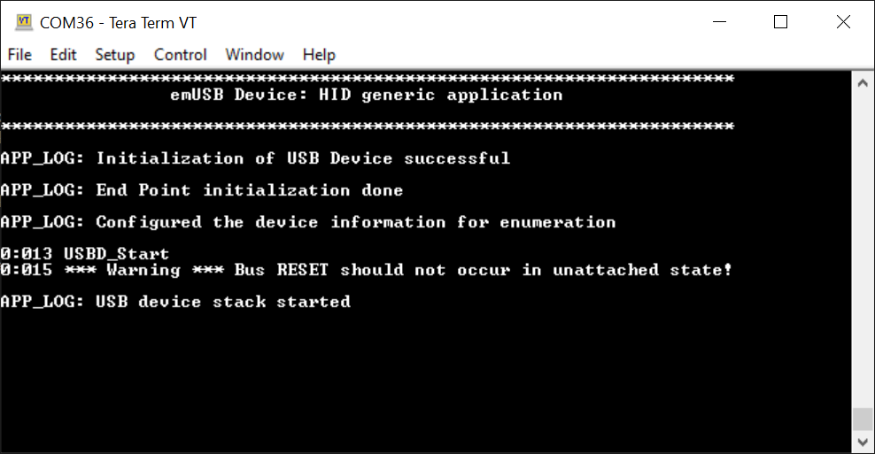

# emUSB Device: HID generic application

This code example demonstrates the usage of emUSB device middleware stack to configure the USB block in a supportd Infineon MCU as a generic Human Interface Device (HID). It takes help from an external HID software tool to send in the generic HID inputs which it then relays back. 


[View this README on GitHub.](https://github.com/Infineon/mtb-example-usb-device-hid-generic)

[Provide feedback on this code example.](https://cypress.co1.qualtrics.com/jfe/form/SV_1NTns53sK2yiljn?Q_EED=eyJVbmlxdWUgRG9jIElkIjoiQ0UyMzY0NzUiLCJTcGVjIE51bWJlciI6IjAwMi0zNjQ3NSIsIkRvYyBUaXRsZSI6ImVtVVNCIERldmljZTogSElEIGdlbmVyaWMgYXBwbGljYXRpb24iLCJyaWQiOiJoaW1hbnNodSBzaGVraGFyIiwiRG9jIHZlcnNpb24iOiIxLjAuMCIsIkRvYyBMYW5ndWFnZSI6IkVuZ2xpc2giLCJEb2MgRGl2aXNpb24iOiJNQ0QiLCJEb2MgQlUiOiJJQ1ciLCJEb2MgRmFtaWx5IjoiUFNPQyJ9)

## Requirements

- [ModusToolbox&trade; software](https://www.infineon.com/modustoolbox) v3.0 or later (tested with v3.0)
- PSoC&trade; 6 board support package (BSP) minimum required version: 4.0.0
- Programming language: C
- Associated parts: All [PSoC&trade; 6 MCU](https://www.infineon.com/PSoC6) parts

## Supported toolchains (make variable 'TOOLCHAIN')

- GNU Arm&reg; embedded compiler v10.3.1 (`GCC_ARM`) - Default value of `TOOLCHAIN`
- Arm&reg; compiler v6.16 (`ARM`)
- IAR C/C++ compiler v9.30.1 (`IAR`)


## Supported kits (make variable 'TARGET')

- [PSoC&trade; 6 Wi-Fi Bluetooth&reg; prototyping kit](https://www.infineon.com/CY8CPROTO-062-4343W) (`CY8CPROTO-062-4343W`) – Default value of `TARGET`
- [PSoC&trade; 6 Wi-Fi Bluetooth&reg; pioneer kit](https://www.infineon.com/CY8CKIT-062-WIFI-BT) (`CY8CKIT-062-WIFI-BT`)
- [PSoC&trade; 62S2 Wi-Fi Bluetooth&reg; pioneer kit](https://www.infineon.com/CY8CKIT-062S2-43012) (`CY8CKIT-062S2-43012`)
- [PSoC&trade; 62S1 Wi-Fi Bluetooth&reg; pioneer kit](https://www.infineon.com/CYW9P62S1-43438EVB-01) (`CYW9P62S1-43438EVB-01`)
- [PSoC&trade; 62S1 Wi-Fi Bluetooth&reg; pioneer kit](https://www.infineon.com/CYW9P62S1-43012EVB-01) (`CYW9P62S1-43012EVB-01`)
- [PSoC&trade; 62S3 Wi-Fi Bluetooth&reg; prototyping kit](https://www.infineon.com/CY8CPROTO-062S3-4343W) (`CY8CPROTO-062S3-4343W`)
- [PSoC&trade; 62S4 pioneer kit](https://www.infineon.com/CY8CKIT-062S4) (`CY8CKIT-062S4`)
- [PSoC&trade; 62S2 evaluation kit](https://www.infineon.com/CY8CEVAL-062S2) (`CY8CEVAL-062S2`, `CY8CEVAL-062S2-LAI-4373M2`, `CY8CEVAL-062S2-MUR-43439M2`)


## Hardware setup

This example uses the board's default configuration. See the kit user guide to ensure that the board is configured correctly.

**Note:** The PSoC&trade; 6 Bluetooth&reg; LE pioneer kit (CY8CKIT-062-BLE) and the PSoC&trade; 6 Wi-Fi Bluetooth&reg; pioneer kit (CY8CKIT-062-WIFI-BT) ship with KitProg2 installed. The ModusToolbox&trade; software requires KitProg3. Before using this code example, make sure that the board is upgraded to KitProg3. The tool and instructions are available in the [Firmware Loader](https://github.com/Infineon/Firmware-loader) GitHub repository. If you do not upgrade, you will see an error like "unable to find CMSIS-DAP device" or "KitProg firmware is out of date".


## Software setup

This example requires an external HID software tool to act as a generic HID host for the emUSB device.

Instructions in this document use this [USB-HID tool](https://github.com/OpenAcousticDevices/USB-HID-Tool) to write and read data to/from a HID device. 
Download the GitHub project available at this [link](https://github.com/OpenAcousticDevices/USB-HID-Tool/archive/master.zip). You should see a /bin folder that contains the usbhidtool executable available for different systems.

Install a terminal emulator if you don't have one. Instructions in this document use [Tera Term](https://ttssh2.osdn.jp/index.html.en).


## Using the code example

Create the project and open it using one of the following:

<details><summary><b>In Eclipse IDE for ModusToolbox&trade; software</b></summary>

1. Click the **New Application** link in the **Quick Panel** (or, use **File** > **New** > **ModusToolbox&trade; Application**). This launches the [Project Creator](https://www.infineon.com/ModusToolboxProjectCreator) tool.

2. Pick a kit supported by the code example from the list shown in the **Project Creator - Choose Board Support Package (BSP)** dialog.

   When you select a supported kit, the example is reconfigured automatically to work with the kit. To work with a different supported kit later, use the [Library Manager](https://www.infineon.com/ModusToolboxLibraryManager) to choose the BSP for the supported kit. You can use the Library Manager to select or update the BSP and firmware libraries used in this application. To access the Library Manager, click the link from the **Quick Panel**.

   You can also just start the application creation process again and select a different kit.

   If you want to use the application for a kit not listed here, you may need to update the source files. If the kit does not have the required resources, the application may not work.

3. In the **Project Creator - Select Application** dialog, choose the example by enabling the checkbox.

4. (Optional) Change the suggested **New Application Name**.

5. The **Application(s) Root Path** defaults to the Eclipse workspace which is usually the desired location for the application. If you want to store the application in a different location, you can change the *Application(s) Root Path* value. Applications that share libraries should be in the same root path.

6. Click **Create** to complete the application creation process.

For more details, see the [Eclipse IDE for ModusToolbox&trade; software user guide](https://www.infineon.com/MTBEclipseIDEUserGuide) (locally available at *{ModusToolbox&trade; software install directory}/docs_{version}/mt_ide_user_guide.pdf*).

</details>

<details><summary><b>In command-line interface (CLI)</b></summary>

ModusToolbox&trade; software provides the Project Creator as both a GUI tool and the command line tool, "project-creator-cli". The CLI tool can be used to create applications from a CLI terminal or from within batch files or shell scripts. This tool is available in the *{ModusToolbox&trade; software install directory}/tools_{version}/project-creator/* directory.

Use a CLI terminal to invoke the "project-creator-cli" tool. On Windows, use the command line "modus-shell" program provided in the ModusToolbox&trade; software installation instead of a standard Windows command-line application. This shell provides access to all ModusToolbox&trade; software tools. You can access it by typing `modus-shell` in the search box in the Windows menu. In Linux and macOS, you can use any terminal application.

The "project-creator-cli" tool has the following arguments:

Argument | Description | Required/optional
---------|-------------|-----------
`--board-id` | Defined in the `<id>` field of the [BSP](https://github.com/Infineon?q=bsp-manifest&type=&language=&sort=) manifest | Required
`--app-id`   | Defined in the `<id>` field of the [CE](https://github.com/Infineon?q=ce-manifest&type=&language=&sort=) manifest | Required
`--target-dir`| Specify the directory in which the application is to be created if you prefer not to use the default current working directory | Optional
`--user-app-name`| Specify the name of the application if you prefer to have a name other than the example's default name | Optional

<br />

The following example clones the "[Hello world](https://github.com/Infineon/mtb-example-hal-hello-world)" application with the desired name "MyHelloWorld" configured for the *CY8CPROTO-062-4343W* BSP into the specified working directory, *C:/mtb_projects*:

   ```
   project-creator-cli --board-id CY8CPROTO-062-4343W --app-id mtb-example-hal-hello-world --user-app-name MyHelloWorld --target-dir "C:/mtb_projects"
   ```

**Note:** The project-creator-cli tool uses the `git clone` and `make getlibs` commands to fetch the repository and import the required libraries. For details, see the "Project creator tools" section of the [ModusToolbox&trade; software user guide](https://www.infineon.com/ModusToolboxUserGuide) (locally available at *{ModusToolbox&trade; software install directory}/docs_{version}/mtb_user_guide.pdf*).

To work with a different supported kit later, use the [Library Manager](https://www.infineon.com/ModusToolboxLibraryManager) to choose the BSP for the supported kit. You can invoke the Library Manager GUI tool from the terminal using `make library-manager` command or use the Library Manager CLI tool "library-manager-cli" to change the BSP.

The "library-manager-cli" tool has the following arguments:

Argument | Description | Required/optional
---------|-------------|-----------
`--add-bsp-name` | Name of the BSP that should be added to the application | Required
`--set-active-bsp` | Name of the BSP that should be as active BSP for the application | Required
`--add-bsp-version`| Specify the version of the BSP that should be added to the application if you do not wish to use the latest from manifest | Optional
`--add-bsp-location`| Specify the location of the BSP (local/shared) if you prefer to add the BSP in a shared path | Optional

<br />

Following example adds the CY8CPROTO-062-4343W BSP to the already created application and makes it the active BSP for the app:

   ```
   library-manager-cli --project "C:/mtb_projects/MyHelloWorld" --add-bsp-name CY8CPROTO-062-4343W --add-bsp-version "latest-v4.X" --add-bsp-location "local"

   library-manager-cli --project "C:/mtb_projects/MyHelloWorld" --set-active-bsp APP_CY8CPROTO-062-4343W
   ```

</details>

<details><summary><b>In third-party IDEs</b></summary>

Use one of the following options:

- **Use the standalone [Project Creator](https://www.infineon.com/ModusToolboxProjectCreator) tool:**

   1. Launch Project Creator from the Windows Start menu or from *{ModusToolbox&trade; software install directory}/tools_{version}/project-creator/project-creator.exe*.

   2. In the initial **Choose Board Support Package** screen, select the BSP, and click **Next**.

   3. In the **Select Application** screen, select the appropriate IDE from the **Target IDE** drop-down menu.

   4. Click **Create** and follow the instructions printed in the bottom pane to import or open the exported project in the respective IDE.

<br />

- **Use command-line interface (CLI):**

   1. Follow the instructions from the **In command-line interface (CLI)** section to create the application.

   2. Export the application to a supported IDE using the `make <ide>` command.

   3. Follow the instructions displayed in the terminal to create or import the application as an IDE project.

For a list of supported IDEs and more details, see the "Exporting to IDEs" section of the [ModusToolbox&trade; software user guide](https://www.infineon.com/ModusToolboxUserGuide) (locally available at *{ModusToolbox&trade; software install directory}/docs_{version}/mtb_user_guide.pdf*).

</details>


## Operation


1. Connect the board to your PC using the provided USB cable through the KitProg3 USB connector.

2. Open a terminal program and select the KitProg3 COM port. Set the serial port parameters to 8N1 and 115200 baud.

3. Program the board using one of the following:

   <details><summary><b>Using Eclipse IDE for ModusToolbox&trade; software</b></summary>
   <br />

      1. Select the application project in the Project Explorer.

      2. In the **Quick Panel**, scroll down, and click **\<Application Name> Program (KitProg3_MiniProg4)**.
   </details>

   <details><summary><b>Using CLI</b></summary>
   <br />

     From the terminal, execute the `make program` command to build and program the application using the default toolchain to the default target. The default toolchain is specified in the application's Makefile but you can override this value manually:
      ```
      make program TOOLCHAIN=<toolchain>
      ```

      Example:
      ```
      make program TOOLCHAIN=GCC_ARM
      ```
   </details>

4. After programming, the application starts automatically. Confirm that title of the code example is displayed on the UART terminal.


   **Figure 1. Terminal output on program startup**

   


5. The user LED will blink at 2 Hz to indicate that the board is ready to be configured and used as an emUSB HID device.

6. Connect the board to your PC from the PSoC 6 USB Device port via a micro USB cable.

7. The user LED will stop blinking to indicate that the emUSB device has been detected successfully. 

8. On the computer, open a terminal console and run the *usbhidtool* to send a few bytes. The tool requires as argument the VID, PID, number of bytes to send, and data. See the [USB-HID tool documentation](https://github.com/OpenAcousticDevices/USB-HID-Tool/blob/master/README.md) or use the following example:

    **In Windows:**
    ```
    usbhidtool.exe 0x058B 0x0274 4 0xDE 0xAD 0xBE 0xEF
    ```

    **In Linux:**
    ```
    ./usbhidtool 0x058B 0x0274 4 0xDE 0xAD 0xBE 0xEF
    ```
    - After writing to the device, you should see the same data written back to the terminal console.
    ```
    de ad be ef 00 00 00 00 00 00 00 00 00 00 00 00 00 00 00 00 00 00 00 00 00 00 00 00 00 00 00 00 00 00 00 00 00 00 00 00 00 00 00 00 00 00 00 00 00 00 00 00 00 00 00 00 00 00 00 00 00 00 00 00
    ```
    **Note:** The *usbhidtool* always sends 64 bytes to the device, independent of how many bytes provided. Any remaining data is written with zeros.


## Debugging

You can debug the example to step through the code. In the IDE, use the **\<Application Name> Debug (KitProg3_MiniProg4)** configuration in the **Quick Panel**. For details, see the "Program and debug" section in the [Eclipse IDE for ModusToolbox&trade; software user guide](https://www.infineon.com/MTBEclipseIDEUserGuide).

**Note:** **(Only while debugging)** On the CM4 CPU, some code in `main()` may execute before the debugger halts at the beginning of `main()`. This means that some code executes twice – once before the debugger stops execution, and again after the debugger resets the program counter to the beginning of `main()`. See [KBA231071](https://community.infineon.com/t5/Knowledge-Base-Articles/PSoC-6-MCU-Code-in-main-executes-before-the-debugger-halts-at/ta-p/253856) to learn about this and for the workaround.


## Design and implementation

This code example intends to provide the functionality of a generic Human Interface Device (HID) using the Segger emUSB device middleware library. The USB Implementers Forum has defined the Human Interface Device class (HID) as an abstract USB class protocol which was developed for handling devices that would be used directly by users use to control the operation of computer systems. 

The firmware consists of a `main()` function and two separate application functions `usbd_hid_init()` and `usbd_hid_echo_task()` to implement the desired functionality. The main function is responsible for calling the relevant emUSB device middleware target APIs and application functions respectively for the initialization of the emUSB device stack `USBD_Init()`, and setting up the end point information for HID class. For more information regarding the usage of emUSB device Target APIs, refer to the [emUSB Device User Guide](https://github.com/Infineon/emusb-device/blob/master/docs/UM09001_emUSBD.pdf) (locally available at *<mtb_shared>/emusb-device/<version-tag>/docs*)

A report descriptor is a structure which is used to transmit HID control data to and from a human interface device. A report descriptor defines the format of a report and is composed of report items that define one or more top-level collections. Each collection defines one or more HID reports. Usages are a part of HID report descriptors which is used to indicate the vendor's suggested use for a specific control or a group of controls. The usage of an HID application is defined using a usage page ID. More information regarding HID usage pages can be found at the resource links given below. In this example, we have used the usage table for a generic USB device. Refer to Universal Serial Bus Specification and the HID Usage Tables guide for detailed information about HID input, output and feature reports.

The application function `usbd_hid_init()` utilizes the `usb_hid_generic_report` to capture the generic HID description of the emUSB device and set up the USB device endpoint. The generic USB-HID report in `usb_hid_generic_report` is generated using the following documents and HID descriptor tool given by the [USB Implementers Forum](https://www.usb.org/) (USB-IF) on their website.

 Name | Description
------|------------
[HID Spec Definition](https://www.usb.org/sites/default/files/hid1_11.pdf) | Device Class Definition for Human Interface Devices (HID) Firmware Specification (5/27/2001), Version 1.11
[HID Usage Tables](https://www.usb.org/sites/default/files/hut1_3_0.pdf) | HID Usage Tables for Universal Serial Bus (USB) Version 1.3
[HID Descriptor Tool](https://www.usb.org/document-library/hid-descriptor-tool)| Generic HID Descriptor Tool by USB Implementers Forum 


The firmware then configures the device information for enumeration using the target API `USBD_SetDeviceInfo()`. After the USB core configuration is done, the target API `USBD_Start()` is called which initiates a hardware attach and updates the endpoint configuration. The application function `usbd_hid_echo_task()` is where the USB device waits to be configured. The user LED blinks at 2 Hz to signify the wait state. When the USB cable is connected to the device, the host will start enumeration of the device and the device will function as a generic USB HID device which echoes the generic HID inputs to the terminal using the target APIs `USBD_HID_Read()` and `USBD_HID_Write()` to read and write the HID data respectively. 

### Resources and settings

**Table 1. Application resources**

 Resource  |  Alias/object           |    Purpose
 :-------- | :---------------------- | :------------
 USB (HAL) | usb_0_obj               | USB device block configured with generic HID Descriptor 
 UART (HAL)| cy_retarget_io_uart_obj | UART HAL object used by Retarget-IO for Debug UART port
 GPIO (HAL)| CYBSP_USER_LED          | User LED

<br />

## Related resources

Resources  | Links
-----------|----------------------------------
emUSB Device Reference | [emUSB Device](https://github.com/Infineon/emusb-device/blob/master/docs/UM09001_emUSBD.pdf) - USB Device stack for embedded applications
USB HID Documentation | [USB Implementers Forum](https://www.usb.org/) - A nonprofit organization created to promote and support USB. <br /> [Device Class Definition](https://www.usb.org/sites/default/files/hid1_11.pdf) for Human Interface Devices (HID) Firmware Specification—5/27/2001, Version 1.11 <br /> [HID Usage Tables](https://www.usb.org/sites/default/files/hut1_3_0.pdf) for Universal Serial Bus (USB) Version 1.3 <br /> [HID Descriptor Tool](https://www.usb.org/document-library/hid-descriptor-tool) by the USB Implementers Forum
Application notes  | [AN228571](https://www.infineon.com/AN228571) – Getting started with PSoC&trade; 6 MCU on ModusToolbox&trade; software <br />  [AN215656](https://www.infineon.com/dgdl/AN215656) – PSoC&trade; 6 MCU: Dual-CPU system design <br /> 
Code examples  | [Using ModusToolbox&trade; software](https://github.com/Infineon/Code-Examples-for-ModusToolbox-Software) on GitHub <br />
Device documentation | [PSoC&trade; 6 MCU datasheets](https://www.infineon.com/cms/en/search.html#!view=downloads&term=PSoC%206&doc_group=Data%20Sheet) <br /> [PSoC&trade; 6 technical reference manuals](https://www.infineon.com/cms/en/search.html#!view=downloads&term=PSoC%206&doc_group=Additional%20Technical%20Information)
Development kits |Select your kits from the [Evaluation board finder](https://www.infineon.com/cms/en/design-support/finder-selection-tools/product-finder/evaluation-board) page
Libraries on GitHub  | [mtb-pdl-cat1](https://github.com/Infineon/mtb-pdl-cat1) – PSoC&trade; 6 peripheral driver library (PDL)  <br /> [mtb-hal-cat1](https://github.com/Infineon/mtb-hal-cat1) – Hardware abstraction layer (HAL) library <br /> [retarget-io](https://github.com/Infineon/retarget-io) – Utility library to retarget STDIO messages to a UART port <br />
Middleware on GitHub  | [psoc6-middleware](https://github.com/Infineon/modustoolbox-software#psoc-6-middleware-libraries) – Links to all PSoC&trade; 6 MCU middleware <br /> [mqtt](https://github.com/Infineon/mqtt) – MQTT client library and documents <br /> [wifi-connection-manager](https://github.com/Infineon/wifi-connection-manager) – Wi-Fi connection manager (WCM) library and documents <br /> [wifi-mw-core](https://github.com/Infineon/wifi-mw-core) – Wi-Fi middleware core library and documents <br /> [freeRTOS](https://github.com/Infineon/freertos) – FreeRTOS library and documents 
Tools  | [Eclipse IDE for ModusToolbox&trade; software](https://www.infineon.com/modustoolbox) – ModusToolbox&trade; software is a collection of easy-to-use software and tools enabling rapid development with Infineon MCUs, covering applications from embedded sense and control to wireless and cloud-connected systems using AIROC&trade; Wi-Fi and Bluetooth® connectivity devices. <br /> [PSoC&trade; Creator](https://www.infineon.com/cms/en/design-support/tools/sdk/psoc-software/psoc-creator/) – IDE for PSoC&trade; and FM0+ MCU development

<br />

## Other resources


Infineon provides a wealth of data at www.infineon.com to help you select the right device, and quickly and effectively integrate it into your design.

For PSoC&trade; 6 MCU devices, see [How to design with PSoC&trade; 6 MCU - KBA223067](https://community.infineon.com/docs/DOC-14644) in the Infineon Developer community.


## Document history


Document title: CE236475 - emUSB Device: HID generic application

| Version | Description of change |
| ------- | --------------------- |
| 1.0.0   | New code example      |
------
<br />


© Cypress Semiconductor Corporation, 2022. This document is the property of Cypress Semiconductor Corporation, an Infineon Technologies company, and its affiliates ("Cypress").  This document, including any software or firmware included or referenced in this document ("Software"), is owned by Cypress under the intellectual property laws and treaties of the United States and other countries worldwide.  Cypress reserves all rights under such laws and treaties and does not, except as specifically stated in this paragraph, grant any license under its patents, copyrights, trademarks, or other intellectual property rights.  If the Software is not accompanied by a license agreement and you do not otherwise have a written agreement with Cypress governing the use of the Software, then Cypress hereby grants you a personal, non-exclusive, nontransferable license (without the right to sublicense) (1) under its copyright rights in the Software (a) for Software provided in source code form, to modify and reproduce the Software solely for use with Cypress hardware products, only internally within your organization, and (b) to distribute the Software in binary code form externally to end users (either directly or indirectly through resellers and distributors), solely for use on Cypress hardware product units, and (2) under those claims of Cypress’s patents that are infringed by the Software (as provided by Cypress, unmodified) to make, use, distribute, and import the Software solely for use with Cypress hardware products.  Any other use, reproduction, modification, translation, or compilation of the Software is prohibited.
<br />
TO THE EXTENT PERMITTED BY APPLICABLE LAW, CYPRESS MAKES NO WARRANTY OF ANY KIND, EXPRESS OR IMPLIED, WITH REGARD TO THIS DOCUMENT OR ANY SOFTWARE OR ACCOMPANYING HARDWARE, INCLUDING, BUT NOT LIMITED TO, THE IMPLIED WARRANTIES OF MERCHANTABILITY AND FITNESS FOR A PARTICULAR PURPOSE.  No computing device can be absolutely secure.  Therefore, despite security measures implemented in Cypress hardware or software products, Cypress shall have no liability arising out of any security breach, such as unauthorized access to or use of a Cypress product. CYPRESS DOES NOT REPRESENT, WARRANT, OR GUARANTEE THAT CYPRESS PRODUCTS, OR SYSTEMS CREATED USING CYPRESS PRODUCTS, WILL BE FREE FROM CORRUPTION, ATTACK, VIRUSES, INTERFERENCE, HACKING, DATA LOSS OR THEFT, OR OTHER SECURITY INTRUSION (collectively, "Security Breach").  Cypress disclaims any liability relating to any Security Breach, and you shall and hereby do release Cypress from any claim, damage, or other liability arising from any Security Breach.  In addition, the products described in these materials may contain design defects or errors known as errata which may cause the product to deviate from published specifications. To the extent permitted by applicable law, Cypress reserves the right to make changes to this document without further notice. Cypress does not assume any liability arising out of the application or use of any product or circuit described in this document. Any information provided in this document, including any sample design information or programming code, is provided only for reference purposes.  It is the responsibility of the user of this document to properly design, program, and test the functionality and safety of any application made of this information and any resulting product.  "High-Risk Device" means any device or system whose failure could cause personal injury, death, or property damage.  Examples of High-Risk Devices are weapons, nuclear installations, surgical implants, and other medical devices.  "Critical Component" means any component of a High-Risk Device whose failure to perform can be reasonably expected to cause, directly or indirectly, the failure of the High-Risk Device, or to affect its safety or effectiveness.  Cypress is not liable, in whole or in part, and you shall and hereby do release Cypress from any claim, damage, or other liability arising from any use of a Cypress product as a Critical Component in a High-Risk Device. You shall indemnify and hold Cypress, including its affiliates, and its directors, officers, employees, agents, distributors, and assigns harmless from and against all claims, costs, damages, and expenses, arising out of any claim, including claims for product liability, personal injury or death, or property damage arising from any use of a Cypress product as a Critical Component in a High-Risk Device. Cypress products are not intended or authorized for use as a Critical Component in any High-Risk Device except to the limited extent that (i) Cypress’s published data sheet for the product explicitly states Cypress has qualified the product for use in a specific High-Risk Device, or (ii) Cypress has given you advance written authorization to use the product as a Critical Component in the specific High-Risk Device and you have signed a separate indemnification agreement.
<br />
Cypress, the Cypress logo, and combinations thereof, WICED, ModusToolbox, PSoC, CapSense, EZ-USB, F-RAM, and Traveo are trademarks or registered trademarks of Cypress or a subsidiary of Cypress in the United States or in other countries. For a more complete list of Cypress trademarks, visit www.infineon.com. Other names and brands may be claimed as property of their respective owners.